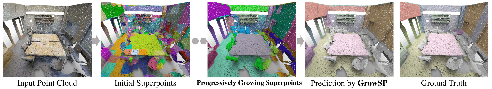

[](https://arxiv.org/abs/2305.16404)

[](https://creativecommons.org/licenses/by-nc-sa/4.0/legalcode)
[](https://twitter.com/vLAR_Group)

## GrowSP: Unsupervised Semantic Segmentation of 3D Point Clouds (CVPR 2023)
[Zihui Zhang](https://scholar.google.com.hk/citations?hl=en&user=jiwazT8AAAAJ&view_op=list_works&sortby=pubdate), [Bo Yang](https://yang7879.github.io/), [Bing Wang](https://www.polyu.edu.hk/en/aae/people/academic-staff/dr-wang-bing/), [Bo Li](https://www4.comp.polyu.edu.hk/~bo2li/)

### Overview

We propose the first unsupervised 3D semantic segmentation method, learning from growing superpoints in point clouds.

<p align="center">

</p>

Our method demonstrates promising results on multiple datasets:

- ***S3DIS Dataset***

<p align="center">


</p>

- ***ScanNet Dataset***

<p align="center">


</p>

- ***SemanticKITTI Dataset***

<p align="center">


</p>

### [Full demo (Youtube)](https://youtu.be/x_UW7hU3Ows)

<p align="center"> <a href="https://youtu.be/x_UW7hU3Ows"></a> </p>


## 1. Setup
Setting up for this project involves installing dependencies. 

### Installing dependencies
To install all the dependencies, please run the following:
```shell script
sudo apt install build-essential python3-dev libopenblas-dev
conda env create -f env.yml
conda activate growsp
pip install -U MinkowskiEngine --install-option="--blas=openblas" -v --no-deps
```
## 2. Running codes
### 2.1 S3DIS
S3DIS dataset can be found [here](
https://docs.google.com/forms/d/e/1FAIpQLScDimvNMCGhy_rmBA2gHfDu3naktRm6A8BPwAWWDv-Uhm6Shw/viewform?c=0&w=1). 
Download the files named "Stanford3dDataset_v1.2_Aligned_Version.zip". Uncompress the folder and move it to 
`${your_S3DIS}`.
And there is an error in `line 180389` of file `Area_5/hallway_6/Annotations/ceiling_1.txt`. 
It need to be fixed manually.

- Preparing the dataset:
```shell script
python data_prepare/data_prepare_S3DIS.py --data_path ${your_S3DIS}
```
This code will preprcocess S3DIS and put it under `./data/S3DIS/input`

- Construct initial superpoints:
```shell script
python data_prepare/initialSP_prepare_S3DIS.py
```
This code will construct superpoints on S3DIS and put it under `./data/S3DIS/initial_superpoints`

- Training:
```shell script
CUDA_VISIBLE_DEVICES=0, python train_S3DIS.py
```
The output model and log file will be saved in `./ckpt/S3DIS` by default. 

### 2.2 ScanNet
Download the ScanNet dataset from [the official website](http://kaldir.vc.in.tum.de/scannet_benchmark/documentation). 
You need to sign the terms of use. Uncompress the folder and move it to 
`${your_ScanNet}`.

- Preparing the dataset:
```shell script
python data_prepare/data_prepare_ScanNet.py --data_path ${your_ScanNet}
```
This code will preprcocess ScanNet and put it under `./data/ScanNet/processed`

- Construct initial superpoints:
```shell script
python data_prepare/initialSP_prepare_ScanNet.py
```
This code will construct superpoints on ScanNet and put it under `./data/ScanNet/initial_superpoints`

- Training:
```shell script
CUDA_VISIBLE_DEVICES=0, python train_ScanNet.py
```
The output model and log file will be saved in `./ckpt/ScanNet` by default.

### 2.3 SemanticKITTI
Please first download the following iterms from [SemanticKITTI](http://www.semantic-kitti.org/dataset.html#download):
- [velodyne point clouds](http://www.cvlibs.net/download.php?file=data_odometry_velodyne.zip)
- [segmentation label](www.semantic-kitti.org/assets/data_odometry_labels.zip)

Uncompressed and Merge the `velodyne` and `labels` of each sequence. 
The organized dataset should be as follows:
```shell script
your_SemanticKITTI
└── sequences
    └── 00
    │   ├── velodyne
    │   ├── labels
    └── 01
    ...
```

- Preparing the dataset:
```shell script
python data_prepare/data_prepare_SemanticKITTI.py --data_path ${your_SemanticKITTI}/sequences
```
This code will preprcocess SemanticKITTI and put it under `./data/SemanticKITTI/dataset`

- Construct initial superpoints:
```shell script
python data_prepare/initialSP_prepare_SemanticKITTI.py
```
This code will construct superpoints on SemanticKITTI and put it under `./data/SemanticKITTI/initial_superpoints`

- Training:
```shell script
CUDA_VISIBLE_DEVICES=0, python train_SemanticKITTI.py
```
The output model and log file will be saved in `./ckpt/SemanticKITTI` by default.
## 3. Trained models
The trained models for these three datasets can be found at [here](
https://drive.google.com/file/d/1Qga6o3NOoE96GZDGusdGJkfpHMqDsy9X/view?usp=sharing)
