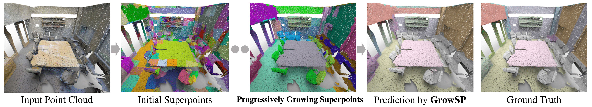
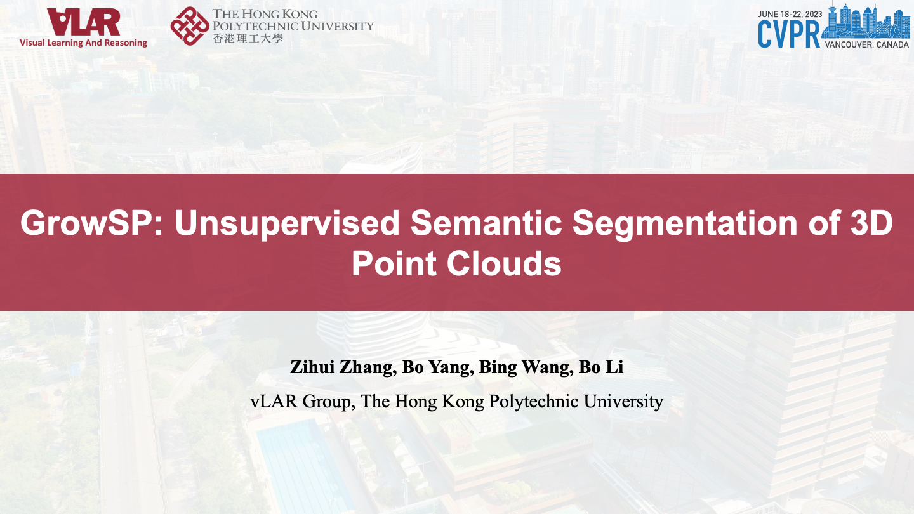

## GrowSP: Unsupervised Semantic Segmentation of 3D Point Clouds (CVPR 2023)
[Zihui Zhang](https://scholar.google.com.hk/citations?hl=en&user=jiwazT8AAAAJ&view_op=list_works&sortby=pubdate), [Bo Yang](https://yang7879.github.io/), [Bing Wang](https://www.polyu.edu.hk/en/aae/people/academic-staff/dr-wang-bing/), [Bo Li](https://www4.comp.polyu.edu.hk/~bo2li/)

### Overview

We propose the first unsupervised 3D semantic segmentation method, learning from growing superpoints in point clouds.

Our method demonstrates promising results on multiple datasets:

- ***S3DIS Dataset***

- ***ScanNet Dataset***

- ***SemanticKITTI Dataset***

### [Full demo (Youtube)](https://youtu.be/x_UW7hU3Ows)

  

